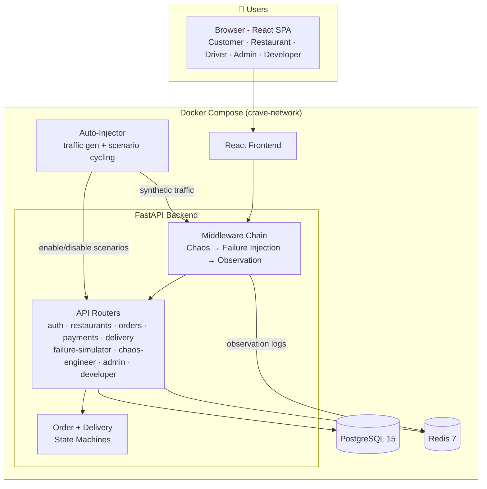
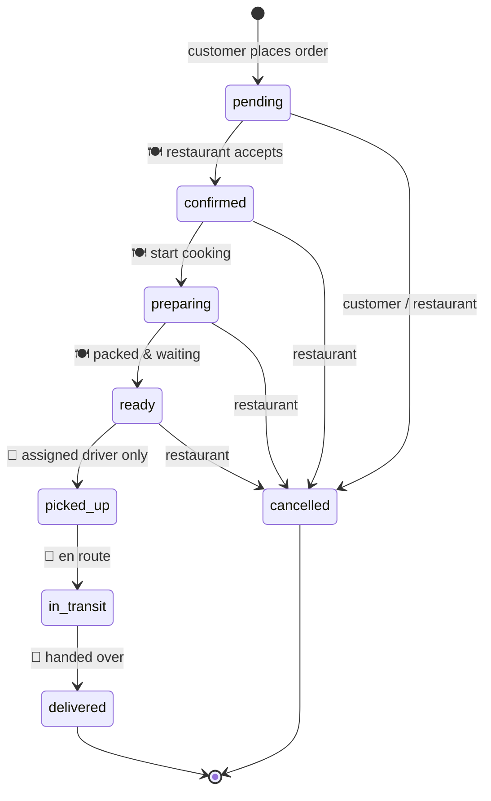
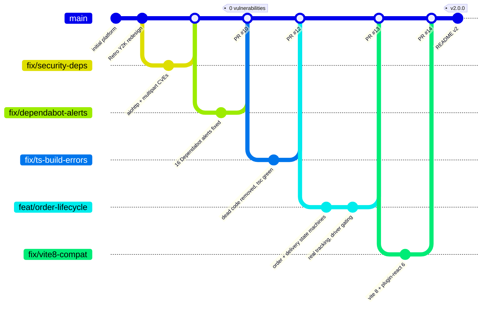

<div align="center">

# 🍔🔥 CRAVE Chaos Kitchen

### A Full-Stack Food Delivery Platform with a Built-In Chaos Lab

*Order food • Run a restaurant • Deliver as a driver • Break everything on purpose*

[](https://python.org)
[](https://fastapi.tiangolo.com)
[](https://react.dev)
[](https://typescriptlang.org)
[](https://vite.dev)
[](https://postgresql.org)
[](https://redis.io)
[](https://docker.com)
[](https://github.com/ParthGarg7/crave-chaos-kitchen/releases/tag/v2.0.0)

---

</div>

## 🌟 What is CRAVE Chaos Kitchen?

CRAVE is a **complete food delivery web application** - customers browse restaurants and place orders, restaurant owners accept and prepare them, drivers claim ready orders and deliver them, all tracked live on a real order timeline with validated state machines.

What makes it different from every other food delivery clone: **it ships with its own chaos engineering lab.** A built-in failure simulator injects 9 classes of realistic API failures (rate limits, timeouts, database errors, dependency outages, service overload) with configurable probability per endpoint, an auto-injector cycles failure scenarios while generating realistic traffic, and an observation layer records every request. Break it on purpose, watch how it behaves, and study real failure modes in a system you fully control.

1. 🛒 **Order** - full customer flow: browse → cart → pay (card/UPI/cash) → live tracking
2. 🍽️ **Manage** - restaurant dashboard: accept/reject, prepare, mark ready
3. 🛵 **Deliver** - driver dashboard: claim ready orders, advance delivery, get rated
4. 💥 **Break** - failure simulator + chaos engineer + auto-injector, all role-guarded
5. 🔭 **Observe** - every request logged with latency, status, and failure tags

---

## 🏗️ System Architecture



---

## 🔄 Order Lifecycle

Every order flows through a **validated state machine** - no skipped states, no going backwards, and each transition is authorized per role:



| Rule | Enforcement |
|------|-------------|
| Drivers only see orders marked **Ready** | `/delivery/available` gated on order status |
| Only the **assigned** driver can advance pickup → delivered | driver ↔ delivery match checked per request |
| Cancelling an order **voids its delivery** | delivery marked `failed`, disappears from driver queues |
| Customer cancels while **pending**; restaurant until **pickup** | role-based cancellation matrix |
| ETA computed at confirmation | prep time + route estimate → `estimated_delivery_time` |
| Ratings come from **customers**, not drivers | `POST /delivery/{id}/rate` after delivery |

---

## 💥 The Chaos Lab

Nine configurable failure scenarios, each with its own probability, target endpoints, and error semantics:

| Scenario | Failure Type | HTTP | Simulates |
|----------|--------------|:----:|-----------|
| `rate_limiting` | Rate limit | 429 | Traffic exceeding API quotas |
| `auth_expiration` | Authentication | 401 | Expired sessions/tokens |
| `payment_timeout` | Timeout | 408/504 | Slow payment gateway |
| `database_error` | Server error | 500 | Connection pool exhaustion |
| `validation_error` | Bad request | 400 | Malformed client data |
| `stripe_dependency` | Dependency | 502/503 | Payment provider outage |
| `maps_dependency` | Dependency | 502/503 | Location service outage |
| `config_error` | Configuration | 500 | Bad config deployment |
| `service_overload` | Unavailable | 503 | Global overload (all endpoints) |

Drive it three ways, all from the **developer dashboard** (role-guarded):

- **Failure Simulator** - toggle scenarios, tune probabilities, set a global failure rate, watch live metrics
- **Chaos Engineer** - targeted chaos experiments against specific endpoints
- **Auto-Injector** - a dedicated container that cycles scenarios on a schedule (`IDLE → ACTIVE → PAUSED` state machine) while generating realistic logged-in traffic

Every request that flows through the system is captured by the observation middleware with latency, status code, and failure tags - browsable live in the observation logs panel.

---

## 🧑‍🤝‍🧑 Roles & Dashboards

| Role | Landing | What they can do |
|------|---------|------------------|
| 🛒 **Customer** | `/browse`, `/orders` | Browse restaurants, order, pay, track live timeline, cancel while pending, rate delivery |
| 🍽️ **Restaurant Owner** | `/restaurant-dashboard` | Accept/Reject incoming orders, advance Preparing → Ready, manage menu & availability |
| 🛵 **Driver** | `/driver-dashboard` | Go online, claim ready orders, advance delivery states, share location |
| ⚙️ **Admin** | `/admin` | User registry, activate/deactivate accounts, assign drivers manually |
| 🛠️ **Developer** | `/developer` | Failure simulator, chaos engineer, injector control, observation logs, dual-view panels |

### Demo Credentials

| Role | Email | Password |
|------|-------|----------|
| Customer | `customer@example.com` | `password123` |
| Restaurant Owner | `restaurant@example.com` | `password123` |
| Driver | `driver@example.com` | `password123` |
| Developer | `developer@example.com` | `developer123` |

---

## 🚀 Quick Start

### Prerequisites

- **Docker** and **Docker Compose** - that's it

### Run it

```bash
git clone https://github.com/ParthGarg7/crave-chaos-kitchen.git
cd crave-chaos-kitchen
docker compose up --build
```

### Access

| Service | URL |
|---------|-----|
| 🖥️ **Frontend** | http://localhost:3001 |
| ⚡ **Backend API** | http://localhost:8001 |
| 📚 **API Docs (Swagger)** | http://localhost:8001/docs |

### Deploy to production

A complete Oracle Cloud Free Tier guide (VM setup, firewall, DuckDNS domain, automatic HTTPS via Caddy) lives in [`deploy/DEPLOY.md`](deploy/DEPLOY.md):

```bash
cp deploy/.env.prod.example .env   # fill in real secrets
docker compose -f docker-compose.prod.yml up -d --build
```

---

## 🔌 API Overview

| Router | Prefix | Highlights |
|--------|--------|-----------|
| Auth | `/api/v1/auth` | JWT register/login/refresh, role-based access |
| Restaurants | `/api/v1/restaurants` | CRUD, menu management, search |
| Orders | `/api/v1/orders` | Create, list, **state-machine status updates**, cancel |
| Payments | `/api/v1/payments` | Card / UPI / cash processing |
| Delivery | `/api/v1/delivery` | Available (READY-gated), accept, advance, location, **rate** |
| Failure Simulator | `/api/v1/failure-simulator` | Enable/disable scenarios, global failure rate, metrics |
| Chaos Engineer | `/api/v1/chaos-engineer` | Targeted chaos experiments |
| Observation Logs | `/api/v1/observation-logs` | Request observation feed (Redis-backed) |
| Admin | `/api/v1/admin` | Session registry, user activation, CSV export |

---

## 🗄️ Data Storage

| Storage | Purpose | Lifetime |
|---------|---------|----------|
| **PostgreSQL** | Users, restaurants, menus, orders, deliveries, payments, API call logs | Permanent |
| **Redis** | Observation logs (capped), injector state, traffic toggle | Ephemeral |

---

## 🧪 Testing

```bash
# Backend - 25 tests (state machines, payments, rate limiting, observation)
cd backend && python -m pytest tests/ -v

# Frontend - type-check + production build
cd frontend && npm run build
```

> Backend tests expect the pinned dependency set (`requirements.txt`) - run them inside the Docker container or a virtualenv on Python ≤3.12.

---

## 🛠️ Tech Stack

<table>
<tr><th>Layer</th><th>Technology</th></tr>
<tr><td><strong>Frontend</strong></td><td>React 18, TypeScript 5, Vite 8 (rolldown), TailwindCSS, Framer Motion, Zustand, TanStack Query</td></tr>
<tr><td><strong>Backend</strong></td><td>FastAPI, Python 3.11, SQLAlchemy 2, Pydantic 2, Uvicorn</td></tr>
<tr><td><strong>Databases</strong></td><td>PostgreSQL 15, Redis 7</td></tr>
<tr><td><strong>Auth</strong></td><td>JWT (python-jose), bcrypt, role-based guards</td></tr>
<tr><td><strong>Chaos</strong></td><td>Failure-injection middleware, chaos engineer, auto-injector, observation layer</td></tr>
<tr><td><strong>DevOps</strong></td><td>Docker Compose (dev + prod stacks), Caddy reverse proxy with automatic HTTPS</td></tr>
</table>

---

## 🌳 Project History

The road to v2.0.0, as merged into `main`:



---

## 🔇 Dormant: external observability hook

The observation middleware can additionally ship every request log to an external RabbitMQ queue for downstream analysis (originally built for a self-healing experiment). This is **off by default** and CRAVE is fully standalone without it. To enable it alongside a compatible consumer:

```bash
docker compose -f docker-compose.yml -f docker-compose.niramay.yml up --build
```
